<picture>
  <source media="(prefers-color-scheme: dark)" srcset="assets/readme/header-dark.svg">
  <source media="(prefers-color-scheme: light)" srcset="assets/readme/header-light.svg">
  
</picture>

  <a href="https://www.zeyaddeeb.com">Website ↗</a> &nbsp; / &nbsp;
  <a href="https://www.zeyaddeeb.com/experiments">Experiments</a> &nbsp; / &nbsp;
  <a href="https://www.linkedin.com/in/zeyaddeeb">LinkedIn</a>

I’m Z, a software engineer in Brooklyn. I build machine learning and distributed systems, mostly with **Rust, TypeScript, and Python**.

This repo is home to my website and experiments in reinforcement learning, real-time collaboration, audio, and graphics.

## Experiments

| Project | | Built with |
| :--- | :--- | :--- |
| [**RL Basketball Agent ↗**](https://robot.zeyaddeeb.com) | A basketball agent trained with reinforcement learning. | Rust · Bevy · SAC |
| [**CRDT Editor ↗**](https://www.zeyaddeeb.com/experiments/crdt) | Collaborative text editing with offline synchronization. | Rust · WebAssembly · WebSocket |
| [**Circle Limit ↗**](https://www.zeyaddeeb.com/experiments/circle-limit) | Animated hyperbolic tilings inspired by M. C. Escher. | Rust · WebAssembly · Canvas |
| [**Game of Life ↗**](https://www.zeyaddeeb.com/experiments/game-of-life) | Conway’s cellular automaton, with Rust and JavaScript engines. | Rust · TypeScript · Canvas |
| [**Speaker Diarization ↗**](https://www.zeyaddeeb.com/experiments/speaker-diarization) | An audio pipeline that identifies speaker changes. | Rust · WebRTC · ONNX |
| [**Audio Visualizer ↗**](https://www.zeyaddeeb.com/experiments/audio-visualizer) | Microphone frequency analysis with four display modes. | Rust · WebAssembly · Web Audio |

## Stack

**Rust · TypeScript · Python · Next.js · WebAssembly** 
**Kubernetes · AWS · Terraform · Helm**

Repository structure

| Directory | |
| :--- | :--- |
| [`www/`](www) | Website, blog, and shared packages |
| [`www/packages/wasm/`](www/packages/wasm) | Rust engines compiled to WebAssembly |
| [`crdt/`](crdt) | Collaborative editing and live presence |
| [`robot/`](robot) | Basketball simulation and reinforcement learning |
| [`voice/`](voice) | Speaker diarization service |
| [`deployments/`](deployments) | Terraform configuration |

